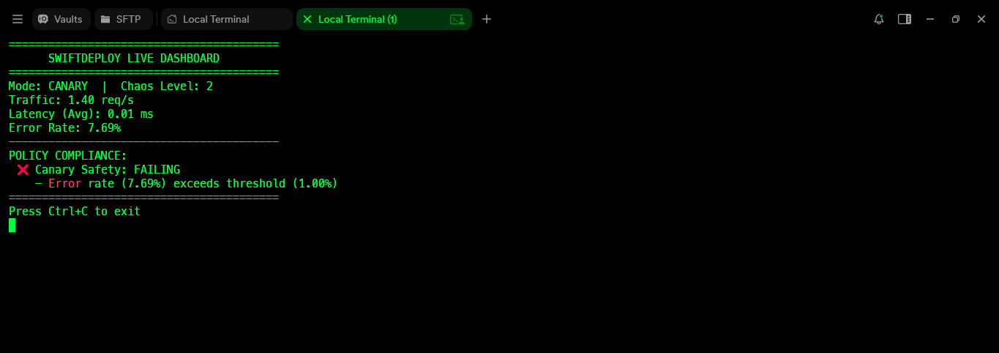

# SwiftDeploy

SwiftDeploy is a declarative Infrastructure as Code (IaC) CLI tool designed to programmatically generate, deploy, and manage a containerized stack from a single source of truth (`manifest.yaml`).

## 🏗️ Architecture

- **API Service:** A lightweight Python/Flask application running via Gunicorn. It exposes a `/metrics` endpoint (Prometheus format) for real-time observability and a `/chaos` endpoint to simulate production degradation.
- **Reverse Proxy (Nginx):** Acts as the public ingress, configured for custom JSON error handling and ISO8601 access logging. 
- **Policy Engine (OPA Sidecar):** An isolated Open Policy Agent container that holds all deployment decision logic via `.rego` files. It strictly enforces a "Zero Leakage" architecture—it is internally accessible to the CLI but completely hidden from the public Nginx port.
- **CLI Engine:** A Python-based automation tool utilizing Jinja2 templating for dynamic configuration generation, real-time metrics polling, and automated audit generation.


## ⚙️ Setup Instructions
1. Clone the repository.
2. Ensure Docker and Docker Compose are installed and running.
3. Build the base application image:
   ```bash
   docker build -t aj-bot-api:latest . 
   ```
4. Install CLI dependencies:
   ```bash
   pip install pyyaml jinja2 
   ```

## 🛠️ Subcommand Walkthrough

### `python swiftdeploy init`
Parses `manifest.yaml` and injects the variables into Jinja2 templates, generating the `docker-compose.yml` and `nginx.conf` files.

### `python swiftdeploy validate`
Executes pre-flight checks to verify manifest syntax, confirm the local Docker image exists, check host port availability, and spawn an isolated container to test Nginx syntax.

### `python swiftdeploy deploy`
**[GATED]** Queries OPA with host metrics (Disk/CPU). If the Infrastructure Policy passes, it generates configurations, executes a detached deployment, and polls the API `/healthz` endpoint until healthy.

### `python swiftdeploy promote [canary|stable]`
**[GATED]** Scrapes `/metrics` for real-time P99 Latency and Error Rates. Queries the OPA Canary Safety policy. If safe, it updates the manifest and performs a zero-downtime rolling restart to shift traffic.

### `python swiftdeploy status`
Boots a live-refreshing terminal dashboard that scrapes metrics, calculates real-time requests/sec, latency, and error rates, and displays live OPA policy compliance. Appends all data to `history.jsonl`.

### `python swiftdeploy audit`
Parses the local `history.jsonl` data to automatically generate an `audit_report.md` file, detailing the complete deployment timeline, mode shifts, and any strict policy violations.

### `python swiftdeploy teardown [--clean]`
Destroys all running containers, networks, and volumes. The optional `--clean` flag deletes generated config files.

---

## 🛡️ Policy Enforcement (Guardrails)

SwiftDeploy delegates all Go/No-Go deployment decisions to OPA. The CLI contains zero hardcoded limits.

- **Infrastructure Policy (pre-deploy):** Prevents deployment if host disk space is critically low or CPU load is dangerously high.
- **Canary Safety Policy (pre-promote):** Blocks any promotion to Stable if the active application error rate exceeds **1.00%** or P99 Latency exceeds **500ms**.

---

## 📊 Observability & Auditing Evidence

### The Chaos Experiment (Policy Blocking a Bad Promotion)
When a **50% error rate** was injected into the Canary build, the SwiftDeploy dashboard successfully caught the degradation, and OPA actively blocked the promotion to Stable to protect the production environment.



### Audit Trail
The complete timeline of the deployment, including the chaos injection and subsequent policy violations, can be viewed in the generated Audit Report.

## 🔍 Technical Deep Dive

Read the full technical breakdown of how SwiftDeploy was engineered, including architecture diagrams, sidecar isolation strategies, and OPA Rego logic:

👉 [Read the full Dev.to / Hashnode Article Here](https://buildingswiftdeploy.hashnode.dev/building-swiftdeploy-zero-downtime-deployments-with-opa-guardrails-chaos-engineering)